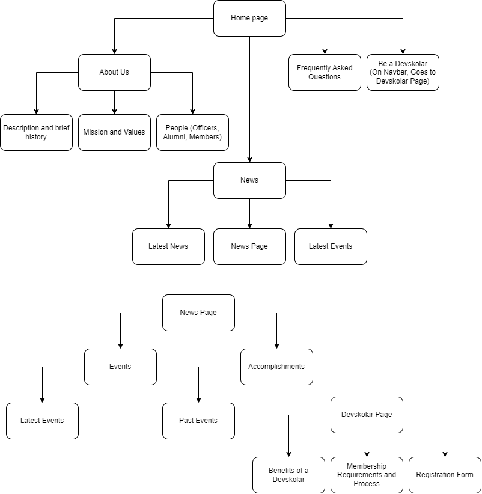

# TPGWebsite
**Description:**

## Table of Contents
- [Discovery Phase](#discovery)
- [Planning Phase](#planning)
- [Designing Phase](#designing)
- [Testing and Delivery Phase](#testing-and-delivery)
- [Maintenance Phase](#maintenance)

## Discovery
**Website Purpose:** To present and share TPG-related content and information.

**Goals of the Website:** 
1. Getting to know TPG 
2. To be a platform for updates and news for the organization.
3. To serve as the Main Contact Page of TPG
4. Provide information for the membership process

**Target Audience:**
1. External Stakeholders (Companies, Organizations, etc.)
2. PUP Students
3. TPG Members (Devskolars)

## Planning
**Site Map:**

**Contents:**

- Navbar
    - Logo
    - "PUP TPG"
    - Navlinks
        - Home (InPage)
        - About Us (InPage)
        - News (InPage)
        - FAQs (InPage)
        - Be A Devskolar (Sends to Devskolar Page)

- Home Page
    - Hero
        - Carousel
            - Highlights
            - Caption on each highlight
    - About Us
        - Description and brief history
        - Mission and values
        - People (Officers, Alumni, Members)
            - Officers shows picture and name
            - Hall of Alumni - dropdown of year and it shows the alumnis of that year (picture and name)
            - Members - just a rectangle banner with the statistics "200+ Members from different Courses in over __ branches" *tentative
    - News 
        - Latest Announcements/News (3) (can be clicked on to read more about it, directed to News Page)
        - Past/Latest Events (3) (can be clicked on to read more about it, directed to News Page)
        - Button for going to the News Page
    - Frequently Asked Questions
            - Can I join TPG?
            - What is TPG?
            - What do you do?

- Footer
    - Social Media and Emails
            - Linkedin
            - Github
            - Discord
            - Facebook
            - Partnership Email
    - (C) 2022 PUP The Programmers' Guild All rights reserved

- News Page
    - Accomplishments
    - Latest Events
    - Past Events
        - Note on Events: Shows partnered organizations

- Devskolar Page
    - Benefits of a devskolar
    - Membership requirements and process
    - Registration Form

**Team and Members(TBA)**
- UI/UX
- Frontend
- Backend
- Management

**Tools and Technologies**
- UI/UX
    - Figma
- Frontend
    - Next.js
- Backend
    - Firebase / Sanity.io
- Documentation
    - Markdown

**Deadline: July 2023**

## Designing

## Development

## Testing and Delivery

## Maintenance

Sources:

https://www.flyingpenguins.in/blogs/phases-of-the-web-site-design-and-development-process/
