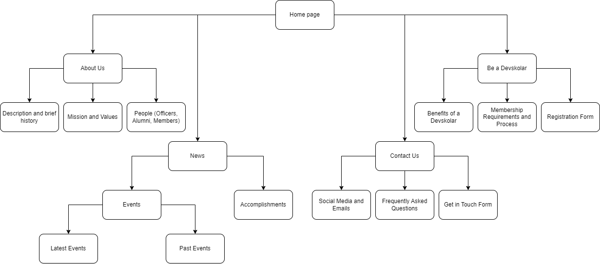

# TPGWebsite
**Description:**

## Table of Contents
---
- [Discovery Phase](#discovery)
- [Planning Phase](#planning)
- [Designing Phase](#designing)
- [Testing and Delivery Phase](#testing-and-delivery)
- [Maintenance Phase](#maintenance)

## Discovery
---
**Website Purpose:**

**Goals of the Website:**

**Target Audience:**

**Type of Content the Target Audience will look for:**

## Planning
---
**Site Map:**

**Contents:**

## Designing
---

## Development
---

## Testing and Delivery
---

## Maintenance
---

Sources:

https://www.flyingpenguins.in/blogs/phases-of-the-web-site-design-and-development-process/